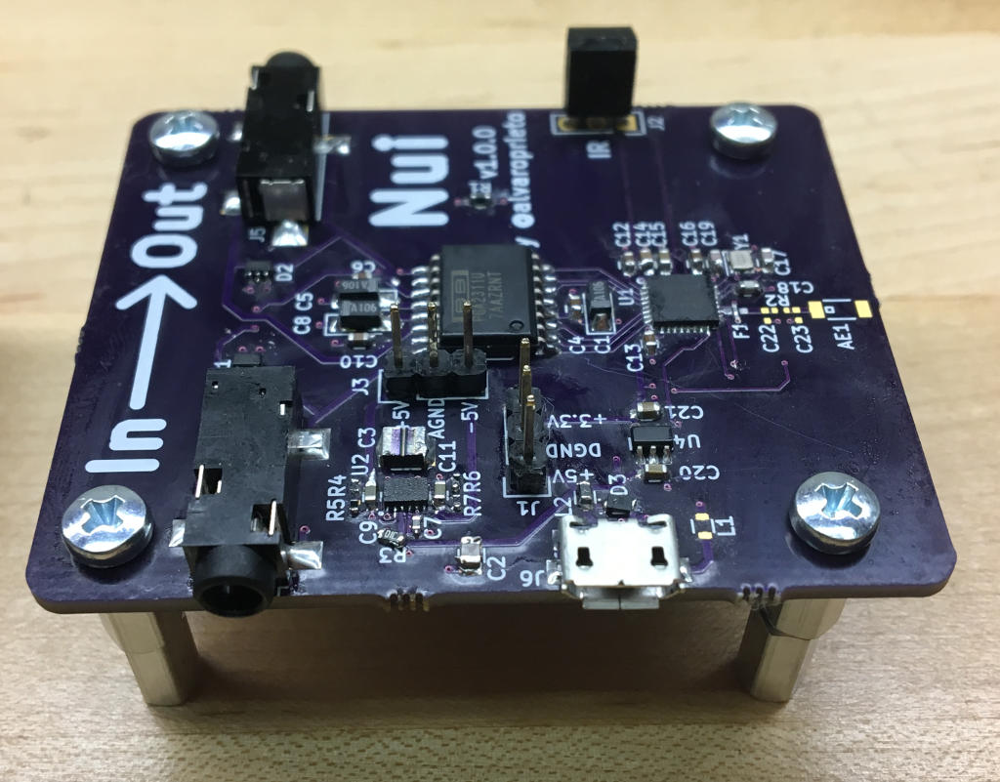

# Nui

## Overview

Nui is an IR(evntually also BLE) controlled volume controller for analog audio. It sits between your audio source and speakers and can amplify or reduce the volume using IR commands (and evntually BLE).

Why do I need this, you may ask?

It all started because I have my trusty Logitech Z-2300 speakers and subwoofer I purchased back arond 2004/5. They still work great, but instead of being on my computer, they are used for my TV. Unfortunately, the TV's line out doesn't honor the TV's volume and is always outputting at max volume. Sure, I can get up and change the volume on the speakers themselves, but wouldn't it be more convenient to do it with the TV remote?!

That's how the Nui project started. It sits between my TV and my speakers and now I don't have to get up to change the volume :D

## Version 0.0.1 (Teensy version)

### Hardware
* The board files can be found [here](https://github.com/alvarop/nui/releases/tag/releases%2Fhw%2Fv0.0.1)

### Firmware
* The arduino/teensy code can be found [here](fw/teensy/nui.ino)

## Version 1.0.0 (NRF52 version)

### Hardware
* The board files can be found [here](hw/)

### Firmware
* The NRF52 code can be found [here](fw/nui/)
